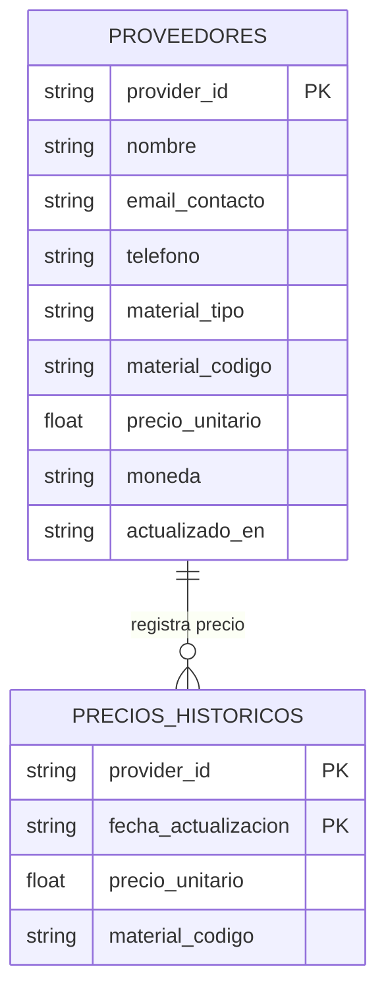

# cloud-computing-ms-proveedores

```mermaid

erDiagram
    PROVEEDORES {
        string provider_id PK
        string nombre
        string email_contacto
        string telefono
        string material_tipo
        string material_codigo
        float precio_unitario
        string moneda
        string actualizado_en
    }

    PRECIOS_HISTORICOS {
        string provider_id PK
        string fecha_actualizacion PK
        float precio_unitario
        string material_codigo
    }

    PROVEEDORES ||--o{ PRECIOS_HISTORICOS : "registra precio"

```
